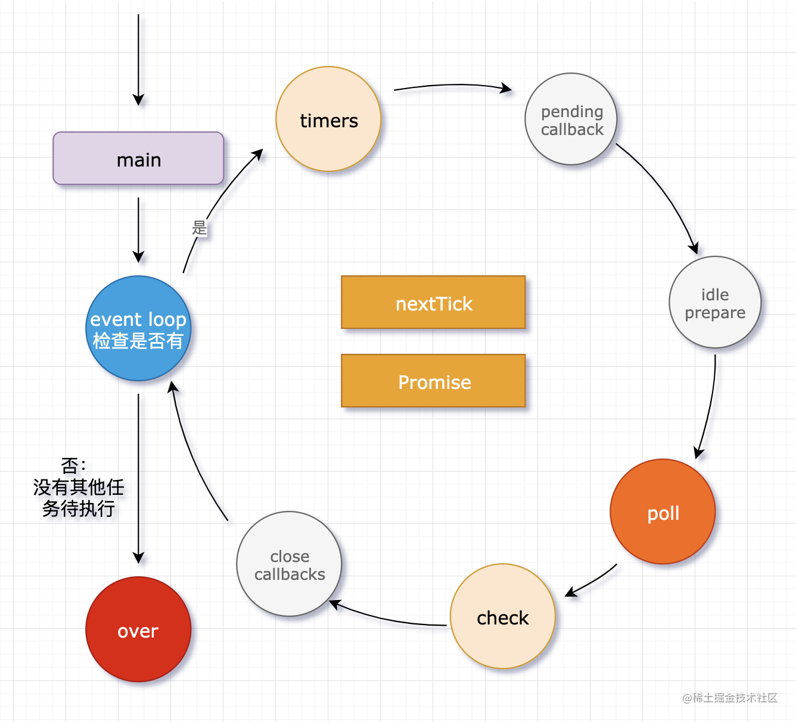

## node 事件循环

- 主函数执行，执行同步代码，遇到异步代码或回调时放到对应的阶段队列。同步代码执行完后，检查是否有回调或异步来决定是否进到 event loop。如果进入事件循环按照上图顺序执行，如果此阶段任务队列中有任务则执行，直到清空此任务队列或达到最大时间限制再进入下个阶段。
- nextTick 和 Promise 是微任务队列，会在进入每个阶段前执行。

### 一次循环要经过六个阶段：

1. timers：计时器（setTimeout、setInterval 等的回调函数存放在里边）
2. pending callback
3. idle prepare
4. poll：轮询队列（除 timers、check 之外的回调存放在这里）
5. check：检查阶段（使用 setImmediate 的回调会直接进入这个队列）
6. close callbacks

### poll 队列的运作方式

- 如果 poll 中有回调函数需要执行，依次执行回调，直到清空队列。如果 poll 中没有回调函数需要执行，已经是空队列了。则会在这里等待，等待其他队列中出现回调，

- 如果其他队列中出现回调，则从 poll 向下到 over，结束该阶段，进入下一阶段。如果其他队列也都没有回调，则持续在 poll 队列等待，直到任何一个队列出现回调后再进行工作。

