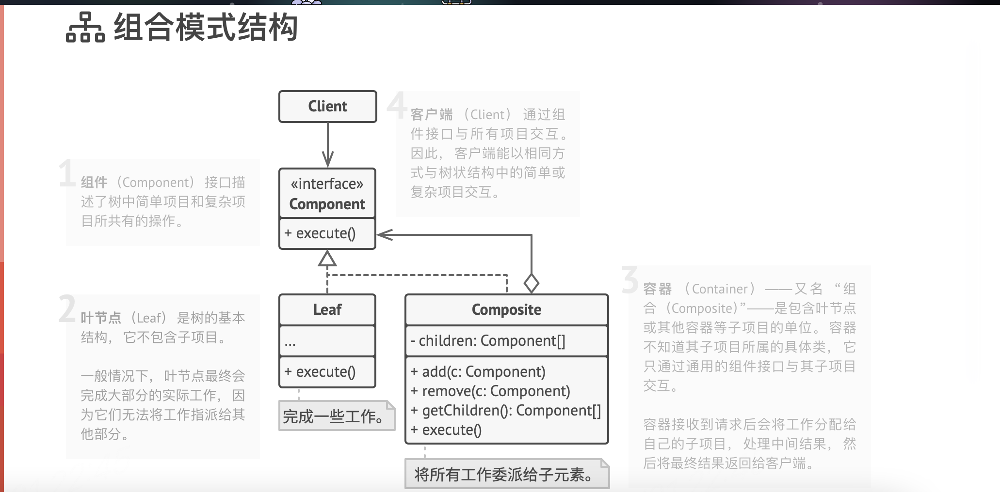

## 组合模式

- 组合模式（Composite Pattern），又叫部分整体模式，是用于把一组相似的对象当作一个单一的对象。组合模式依据树形结构来组合对象，用来表示部分以及整体层次。这种类型的设计模式属于结构型模式，它创建了对象组的树形结构。

- 组合模式 一般包括 组件抽象接口、叶节点、容器, 叶节点和容器需要实现一些共用的操作

- 比如文件系统，组合命令等



```ts
// 容器对象
function macroCommand() {
  return {
    commandList: [],
    add: function (command) {
      this.commandList.push(command);
    },
    execute: function () {
      for (let i = 0; i < this.commandList.length; i++) {
        commandList[i].execute();
      }
    },
  };
}

// 叶对象
const command1 = {
  execute: function () {
    console.log("command1");
  },
};

const command2 = {
  execute: function () {
    console.log("command1");
  },
};

// 生成一个容器对象，并添加一个叶对象
const macroCommand1 = macroCommand();
macroCommand1.push(command1);

// 生成一个容器对象，并且可以添加其他 容器对象 或 叶对象
const command = macroCommand();
command.push(macroCommand1);
command.push(command2);

// 通过统一接口，可以很方便的处理
command.execute();
```

### 优点

- 组合模式为你提供了两种共享公共接口的基本元素类型： 简单叶节点和复杂容器。 容器中可以包含叶节点和其他容器。 这使得你可以构建树状嵌套递归对象结构。
- 组合模式中定义的所有元素共用同一个接口。 在这一接口的帮助下， 客户端代码可以很简单的以相同方式处理简单和复杂元素
